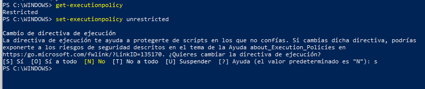
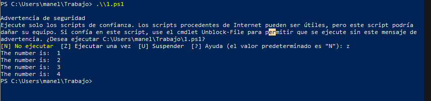
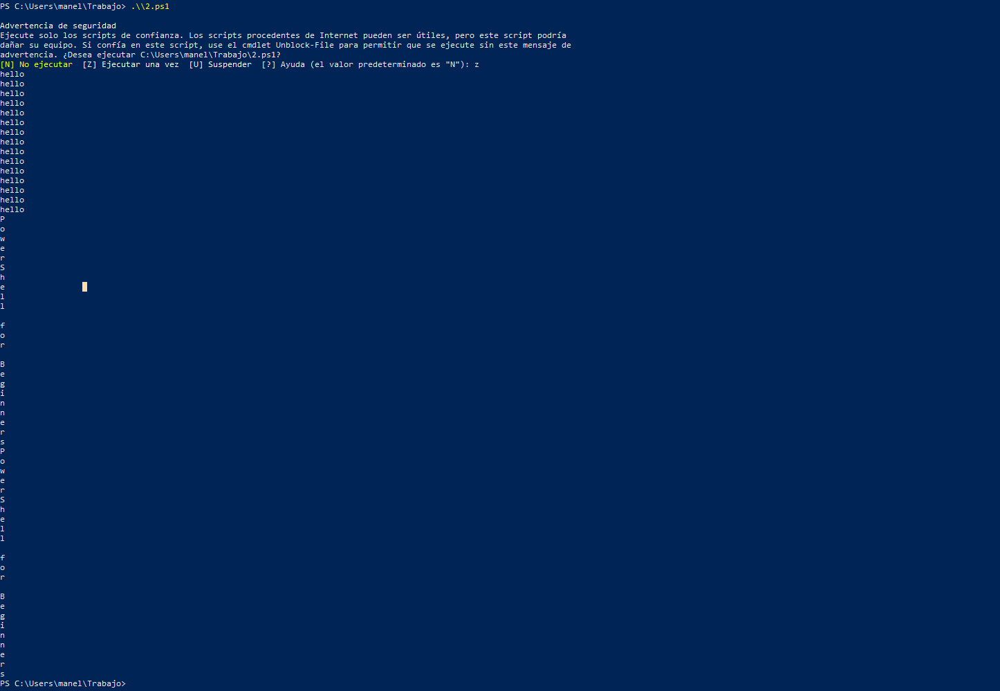
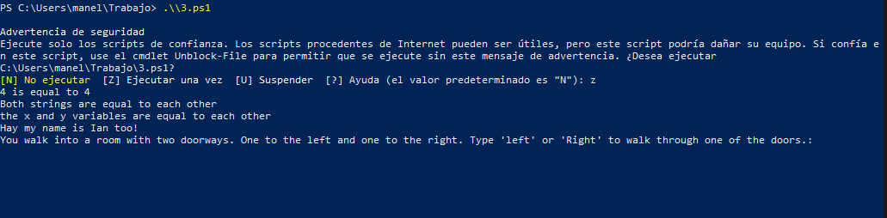

# Practica-powershell
Antes de poder realizar la práctica de hoy, debemos cambiar los ajustes de powershell y cambiar el acceso restringido

Una vez realizado el cambio procedemos a abrir el primer script.

Seguidamente, abrimos el segundo

Y el tercero

